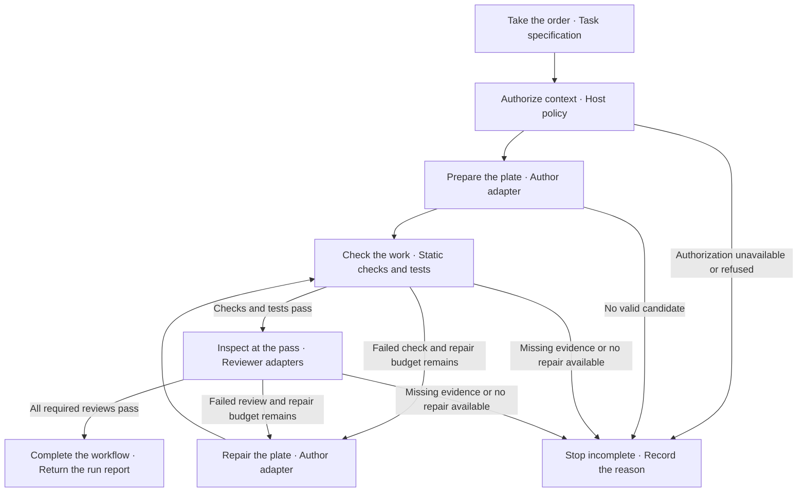

# Nisi v0.1

> [!WARNING]
> **Private next-version integration workspace — not the public 0.1.0 release.**
> This working copy is preparing the Veritas-to-Nisi merger. Its development
> identifier is `0.2.0-private.0`; package publication is disabled. The existing
> Apache-2.0 license continues to accompany the original Nisi code; it does not
> grant publication permission for newly staged private material. Do not publish
> this tree, its designs, examples, tests or results without the existing exact
> legal and engineering release approvals. See [the roadmap](roadmap.md).
>
> **Why this matters:** A private working copy and a package flag reduce accidental
> release risk; neither prevents a Git push or establishes legal clearance.

The following documentation describes the retained Nisi foundation. Staging a
Veritas component here does not make it an integrated or released Nisi feature.

**A Node.js library for running AI-assisted coding workflows.**

Use Nisi when your application needs to coordinate drafting, checks, tests,
review, and a limited repair cycle. You supply the task and tool integrations;
Nisi returns proposed file contents and a report showing what passed, what
failed, and why the run stopped. Fixed criteria and repair limits keep each
attempt tied to the original request.

**Status: working prototype.** Run it from a source checkout. The
[verification record](https://github.com/louiscalata/nisi/blob/main/docs/verification.md)
identifies the tested versions and environments.

## Quick start

Install Node.js 22 or newer, then run:

```bash
git clone https://github.com/louiscalata/nisi.git
cd nisi
npm ci
npm run example:workflow
```

The example drafts an intentionally incorrect JavaScript module, runs a syntax
check and two assertions, repairs it once, obtains a separate review callback's
result, and writes and verifies a report. It makes no model calls.
The output includes:

```json
{
  "outcome": "COMPLETED",
  "repairAttempts": 1,
  "reportStored": true
}
```

Run `npm run check` to check the codec and run the test suite. npm 11 checks the
Node requirement before install and run commands; the check and example scripts
also validate Node directly.

## Use it in an application

Start with the complete [workflow example](https://github.com/louiscalata/nisi/blob/main/examples/workflow.mjs).
Replace its fixed task and callbacks with your application's requirements and
tools. A task defines allowed file names, acceptance criteria, a deadline,
a repair budget, and the required reviewer count.

The integration has this shape; `task` and the callbacks below are supplied by
your application:

```js
import { runWorkflow } from 'nisi/workflow';

const report = await runWorkflow(task, {
  adapters: {
    authorizeContext: { authorize },
    author: { id: 'author.primary', draft, repair },
    staticChecks: { check },
    tests: { run },
    reviewers: [{ id: 'reviewer.primary', review }],
  },
});
```

Within this checkout, the package import resolves to Nisi's workflow module.
See the [Workflow API](https://github.com/louiscalata/nisi/blob/main/docs/workflow-api.md)
for callback inputs, return schemas, error outcomes, and optional report storage.
Your application decides whether to apply the candidate's file contents.

## Local model adapters

For model-generated JSON configuration, start a compatible local chat server
with JSON-schema output support. Replace both placeholders with different
configured model names:

```bash
npm run example:local-model -- \
  http://127.0.0.1:1234/v1/chat/completions AUTHOR_MODEL REVIEWER_MODEL
```

The example checks four fixed assertions and sends the candidate and results
to the reviewer. It evaluates JSON as data. Invalid arguments produce a setup
error before any model request. See the
[local model guide](https://github.com/louiscalata/nisi/blob/main/docs/local-models.md)
for endpoint requirements, timeouts, and response validation. The server and
models are configured by the host application.

## Architecture

The **Workflow Orchestrator** (`runWorkflow`) calls adapters in sequence and
validates their result records. An **adapter** is a callback object that connects
one workflow role to an application tool or model. Separate author and reviewer
IDs make responsibilities explicit; the host supplies trustworthy implementations.

In the kitchen analogy, the task is the order, permitted context is the
ingredients, and the candidate is the plate. The orchestrator is the sous chef
coordinating stations; the reviewer is the expo checking the plate at the pass.
A station can be ordinary code, a test process, or a model adapter.

### The Path of One Plate

An edit task follows this path. A repaired candidate must pass fresh checks,
tests, and review. Cancellation or a deadline can stop the run at any stage.



Review mode starts with an existing candidate and runs authorization, checks,
tests, and review without drafting or repair. The
[architecture guide](https://github.com/louiscalata/nisi/blob/main/docs/architecture.md)
defines workflow, pipeline, run, state, stage status, and final outcome.

### Components

| Component | Responsibility |
|---|---|
| Workflow Orchestrator | Sequence stages, validate evidence, limit repairs, return a run report |
| Local Chat Adapters | Send author and reviewer requests to a configured loopback HTTP endpoint |
| File Access Policy | Admit file content under the separate Apple on-device destination contract |
| JSON Canonicalizer | Produce stable bytes and digests under Nisi's restricted integer-only JSON profile |
| Apple Foundation Models Adapter | Run and validate a native advisory helper in a compatible Apple environment |
| Static Analysis Check | Check selected direct call patterns in the JSON codec |

Nisi validates what adapters report. `COMPLETED` means the required stages
returned valid passing evidence; callback honesty and actual file access remain
host responsibilities. The host also owns applying changes and release decisions.

## Documentation

- [Workflow API reference](https://github.com/louiscalata/nisi/blob/main/docs/workflow-api.md) — task, candidate, callback, and report contracts.
- [Architecture](https://github.com/louiscalata/nisi/blob/main/docs/architecture.md) — components, terminology, and trust boundaries.
- [Local models](https://github.com/louiscalata/nisi/blob/main/docs/local-models.md), [file access](https://github.com/louiscalata/nisi/blob/main/docs/file-policy.md), and [Apple integration](https://github.com/louiscalata/nisi/blob/main/docs/apple-foundation-models.md) — integration setup and limits.
- [Verification](https://github.com/louiscalata/nisi/blob/main/docs/verification.md) — retained test and integration results.
- [Editable README](https://github.com/louiscalata/nisi/tree/main/docs/editor) — download the HTML to edit every section locally.

## Support and license

Questions and reproducible reports are welcome in
[GitHub Issues](https://github.com/louiscalata/nisi/issues). See the
[contribution policy](https://github.com/louiscalata/nisi/blob/main/CONTRIBUTING.md)
and [security scope](https://github.com/louiscalata/nisi/blob/main/SECURITY.md).
Pull requests are not currently accepted. Maintained by Louis Calata; licensed
under [Apache-2.0](https://github.com/louiscalata/nisi/blob/main/LICENSE).

## Background

Nisi grew out of **initiate online code mode**, the assistant skill Louis uses
to organize coding work. Its portable rules became this library: fixed scope,
defined responsibilities, separate review, and bounded repair. The assistant
skill is optional. Codex and Claude were used during development.
