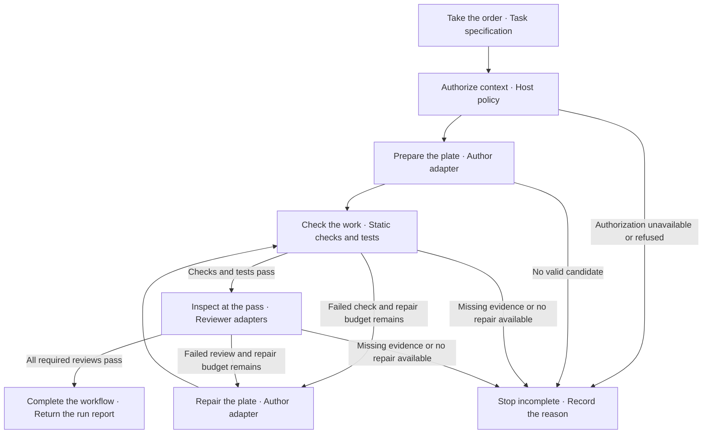
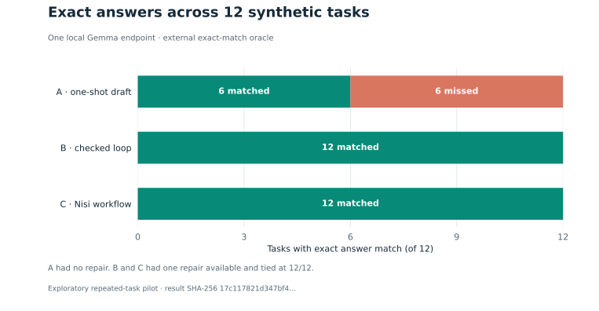
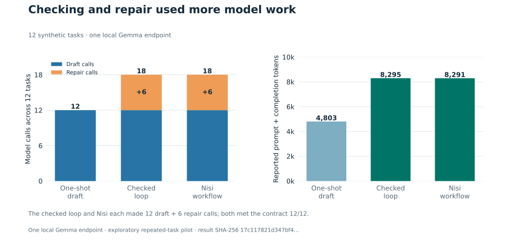
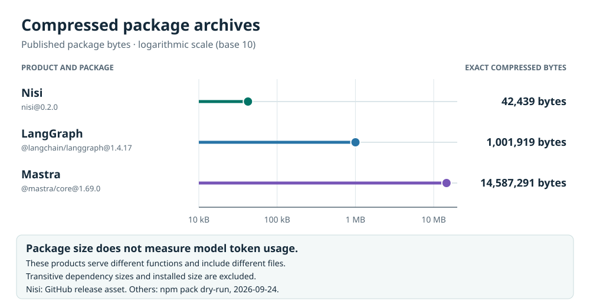

# Nisi v0.2

**A Node.js command-line tool and library for AI-assisted coding workflows.**

Use Nisi when your application needs to coordinate drafting, checks, tests,
review, and a limited repair cycle. You supply the task and tool integrations;
Nisi returns proposed file contents and a report showing what passed, what
failed, and why the run stopped. Fixed criteria and repair limits keep each
attempt tied to the original request.

**v0.2.0 is the first public CLI release.** Its command runs a fixed workflow
demonstration or a fixed local-model JSON demonstration. Applications can use
the workflow, journal, and store APIs directly. This release does not run
arbitrary repositories from the command line. The [v0.1 verification
record](https://github.com/louiscalata/nisi/blob/main/docs/verification.md)
describes the earlier release. The [v0.2 verification record](https://github.com/louiscalata/nisi/blob/main/docs/verification-v0.2.md)
records the checks for this release and their limits.

## Quick start

Install Node.js 22 or newer, then run the fixed, model-free demonstration:

```bash
git clone --branch v0.2.0 --depth 1 https://github.com/louiscalata/nisi.git
cd nisi
node bin/nisi.mjs demo
```

The example drafts an intentionally incorrect JavaScript module, runs a syntax
check and two assertions, repairs it once, obtains a separate review callback's
result, and writes and verifies a report. It makes no model calls.
The output includes:

```json
{
  "outcome": "COMPLETED",
  "repairAttempts": 1,
  "reportStored": true
}
```

Run `npm ci` followed by `npm run check` to check the codec and run the test
suite. The package declares Node.js 22 or newer, and the check script validates
it directly. The [GitHub release](https://github.com/louiscalata/nisi/releases/tag/v0.2.0)
also provides an npm-format archive for local installation; Nisi v0.2.0 is not
published to the npm registry.

## Command line

From a source checkout, run `node bin/nisi.mjs --help` to see the supported
commands. An installed release archive provides the `nisi` executable.
`nisi demo` runs the same fixed workflow shown above, with no model call.
`nisi local-model` runs a fixed JSON-configuration task against a configured
loopback chat server. It does not execute model-generated programs or apply
changes to a repository. The host application remains responsible for any
broader coding task and for deciding whether to apply proposed files.

To use the downloadable `nisi-0.2.0.tgz` archive without cloning the source,
install it into a new project folder with
`npm install /path/to/nisi-0.2.0.tgz --ignore-scripts`. Run
`./node_modules/.bin/nisi demo` on macOS or Linux, or
`.\node_modules\.bin\nisi.cmd demo` in Windows PowerShell. The archive does not
install models or start a model server.

## What is new in v0.2

v0.2 adds the public `nisi` command, a **run journal**, and a disk store for it.
The journal is an append-only, hash-chained record of what a run observed. A host can write it,
reopen it after a process restart, and check it before relying on its rows.
These modules live under `history/`. The v0.1 workflow and local-model adapter
are unchanged; results measured with a separate private adapter do not apply
to this public package.

- **Run journal** (`history/run-journal-v1.mjs`, import `nisi/history/run-journal`).
  `createRunJournal(config)` validates every entry (fixed keys, identifier
  formats, safe integers, one of six states), reports duplicate and conflicting
  re-appends, refuses invalid retries, revocations, and project mismatches,
  applies the configured payload redaction before anything is stored, and
  retires entries past their TTL or beyond the configured maximum by clearing
  their payloads while keeping their place in the chain. `list(now)` reports
  each entry's liveness: `RUNNING` with a fresh heartbeat, `UNKNOWN` once the
  heartbeat is stale, `EXPIRED` after its TTL, or `REVOKED`. `serialize()`
  produces canonical JSON lines with a header, a SHA-256 chain, and a footer;
  `reopen(serialized)` rebuilds the journal and returns a recovery report
  (`COMPLETE`, `INCOMPLETE` for truncated input, or `INVALID`). A journal
  reopened from damaged input is sealed and refuses further appends. The
  module imports only `node:crypto` and `node:util`.
  Fingerprints and duplicate detection use the redacted entry. Changes only to
  redacted values therefore compare as duplicates; the original values cannot
  be reconstructed from the journal.
- **Journal store** (`history/run-journal-store-v1.mjs`, import `nisi/history/run-journal-store`).
  `writeSerializedJournal` and `readSerializedJournal` move a serialized
  journal to and from disk through a caller-supplied `fs`. A write validates
  the chain first, goes through an exclusive temp file in the same directory,
  syncs the file and its directory, verifies by reading back, and renames into
  place. Each write attempt uses its own temporary filename, so an orphaned
  temporary file from a stopped process does not block an identical retry.
  `expectedPreviousSha256` detects stale **sequential** writes; it is not an
  atomic guard for concurrent writers. Use one writer per journal and
  serialize writes in the host. The store reports `committed` and `durable`
  separately, so a write that landed without confirmed file and directory
  sync is never reported as durable. A read refuses truncated, non-canonical,
  malformed-UTF-8, or chain-broken files instead of returning partial data.

The public package does not include a recovery worker. Package exports are
limited to the declared runtime modules; old undocumented deep imports may no
longer resolve. A host owns the journal
location outside the package and can call `readSerializedJournal` followed by
`reopen` after a restart. A stopped write may leave a file named
`journal.jsonl.<sha256>.<uuid>.tmp` beside the journal. Inspect the owner and
destination before removing an orphan. Journal views and recovery reports carry
`authorizing: false`; they record observations and grant no authority.

## Use it in an application

Start with the complete [workflow example](https://github.com/louiscalata/nisi/blob/main/examples/workflow.mjs).
Replace its fixed task and callbacks with your application's requirements and
tools. A task defines allowed file names, acceptance criteria, a deadline,
a repair budget, and the required reviewer count.

The integration has this shape; `task` and the callbacks below are supplied by
your application:

```js
import { runWorkflow } from 'nisi/workflow';

const report = await runWorkflow(task, {
  adapters: {
    authorizeContext: { authorize },
    author: { id: 'author.primary', draft, repair },
    staticChecks: { check },
    tests: { run },
    reviewers: [{ id: 'reviewer.primary', review }],
  },
});
```

Within this checkout, the package import resolves to Nisi's workflow module.
See the [Workflow API](https://github.com/louiscalata/nisi/blob/main/docs/workflow-api.md)
for callback inputs, return schemas, error outcomes, and optional report storage.
Your application decides whether to apply the candidate's file contents.

## Local model adapters

For model-generated JSON configuration, start a compatible local chat server
with JSON-schema output support. Replace both placeholders with different
configured model names:

```bash
node bin/nisi.mjs local-model \
  http://127.0.0.1:1234/v1/chat/completions AUTHOR_MODEL REVIEWER_MODEL
```

The example checks four fixed assertions and sends the candidate and results
to the reviewer. It evaluates JSON as data. Invalid arguments produce a setup
error before any model request. See the
[local model guide](https://github.com/louiscalata/nisi/blob/main/docs/local-models.md)
for endpoint requirements, timeouts, and response validation. The server and
models are configured by the host application.

## Architecture

The **Workflow Orchestrator** (`runWorkflow`) calls adapters in sequence and
validates their result records. An **adapter** is a callback object that connects
one workflow role to an application tool or model. Separate author and reviewer
IDs make responsibilities explicit; the host supplies trustworthy implementations.

In the kitchen analogy, the task is the order, permitted context is the
ingredients, and the candidate is the plate. The orchestrator is the sous chef
coordinating stations; the reviewer is the expo checking the plate at the pass.
A station can be ordinary code, a test process, or a model adapter.

### The Path of One Plate

An edit task follows this path. A repaired candidate must pass fresh checks,
tests, and review. Cancellation or a deadline can stop the run at any stage.



Review mode starts with an existing candidate and runs authorization, checks,
tests, and review without drafting or repair. The
[architecture guide](https://github.com/louiscalata/nisi/blob/main/docs/architecture.md)
defines workflow, pipeline, run, state, stage status, and final outcome.

### Components

| Component | Responsibility |
|---|---|
| Workflow Orchestrator | Sequence stages, validate evidence, limit repairs, return a run report |
| Local Chat Adapters | Send author and reviewer requests to a configured loopback HTTP endpoint |
| File Access Policy | Admit file content under the separate Apple on-device destination contract |
| JSON Canonicalizer | Produce stable bytes and digests under Nisi's restricted integer-only JSON profile |
| Apple Foundation Models Adapter | Run and validate a native advisory helper in a compatible Apple environment |
| Static Analysis Check | Check selected direct call patterns in the JSON codec |
| Run Journal | Keep an append-only, hash-chained record of run observations with redaction, liveness, and verified reopen |
| Journal Store | Write and read a serialized journal through a temp file, sync, read-back, and rename, reporting durability honestly |

Nisi validates what adapters report. `COMPLETED` means the required stages
returned valid passing evidence; callback honesty and actual file access remain
host responsibilities. The host also owns applying changes and release decisions.

## Benchmarks

The benchmark tooling and graphs are on `main`; the v0.2.0 tag and release
archive predate this source update.

### Token use in one local pilot

The [source-checkout benchmarks](benchmarks/value/README.md) exercise workflow
controls, mocked inference interfaces, and orchestration overhead. A separate
[exploratory local pilot](benchmarks/value/results/README.md) used one already
loaded Gemma model through Nisi's released loopback chat adapter. A match
required exactly one `answer.json` file whose JSON object had only an `answer`
key holding the expected value. All six one-shot outputs that failed this
contract contained the expected value without that wrapper. A handwritten
checked loop and Nisi each repaired those six shapes once and tied on all 12
tasks; their draft and repair request bytes matched per task.

The same 12 tasks had appeared in earlier exploratory runs, and server cache
behavior was not measured. Treat these counts as an integration check, not a
general accuracy estimate.

| Arm | Contract matches | Model calls (repairs) | Reported tokens |
|---|---:|---:|---:|
| Direct one-shot | 6 / 12 | 12 (0) | 4,803 |
| Handwritten checked loop | 12 / 12 | 18 (6) | 8,295 |
| Nisi workflow | 12 / 12 | 18 (6) | 8,291 |





The direct arm had no repair opportunity, while each checked arm could repair
once. These graphs show one local integration and the extra model work used by
checking and repair; they do not establish that Nisi outperforms the checked
loop or works with arbitrary inference systems. See the
[contract matches by task family](benchmarks/value/charts/task-families.svg),
[raw candidate and receipt rows](benchmarks/value/results/pilot-local-gemma-20260924.json),
and [study plan](benchmarks/value/LIVE-STUDY.md) for scope and next tests.

### Package footprint

The published v0.2.0 npm-format archive is **42,439 bytes with 18 files**.
At public `main` commit `3cfe3ae`, the source checkout had 118 tracked files
totaling 1,194,053 bytes, including tests, docs, and benchmark evidence. The
chart compares pinned Node package archives, excluding dependency packages;
LangGraph.js and Mastra offer broader capabilities and use different packaging.
Package size is not the amount of context sent to a model and cannot establish
token savings. In the pilot above, Nisi reported just four fewer tokens than
the equally successful checked loop (0.048%), which is not a meaningful saving.



See the [measurement method and product comparison](benchmarks/value/COMPARISON.md)
for pinned sources, capabilities, and the paired study needed before any token
savings claim.

## Documentation

- [Workflow API reference](https://github.com/louiscalata/nisi/blob/main/docs/workflow-api.md) — task, candidate, callback, and report contracts.
- [Architecture](https://github.com/louiscalata/nisi/blob/main/docs/architecture.md) — components, terminology, and trust boundaries.
- [Local models](https://github.com/louiscalata/nisi/blob/main/docs/local-models.md), [file access](https://github.com/louiscalata/nisi/blob/main/docs/file-policy.md), and [Apple integration](https://github.com/louiscalata/nisi/blob/main/docs/apple-foundation-models.md) — integration setup and limits.
- [v0.1 verification](https://github.com/louiscalata/nisi/blob/main/docs/verification.md) and [v0.2 verification](https://github.com/louiscalata/nisi/blob/main/docs/verification-v0.2.md) — version-scoped results and limits.
- [Changelog](https://github.com/louiscalata/nisi/blob/main/CHANGELOG.md) — public changes by version.
- [v0.1 editable README manuscript](https://github.com/louiscalata/nisi/tree/main/docs/editor) — a standalone editor for the earlier README text.

## Support and license

Questions and reproducible reports are welcome in
[GitHub Issues](https://github.com/louiscalata/nisi/issues). See the
[contribution policy](https://github.com/louiscalata/nisi/blob/main/CONTRIBUTING.md)
and [security scope](https://github.com/louiscalata/nisi/blob/main/SECURITY.md).
Pull requests are not currently accepted. Maintained by Louis Calata; licensed
under [Apache-2.0](https://github.com/louiscalata/nisi/blob/main/LICENSE).

## Background

Nisi grew out of **initiate online code mode**, the assistant skill Louis uses
to organize coding work. Its portable rules became this library: fixed scope,
defined responsibilities, separate review, and bounded repair. The assistant
skill is optional. Codex and Claude were used during development.
