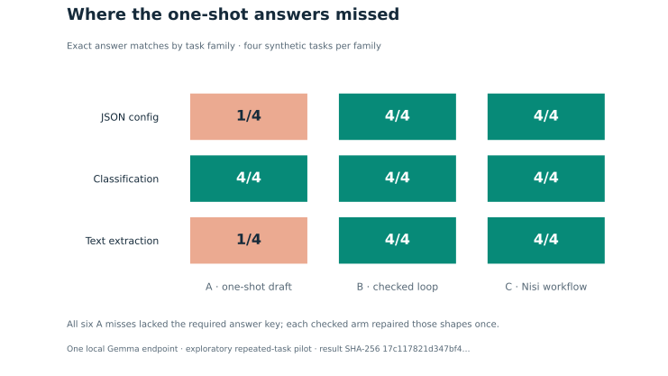
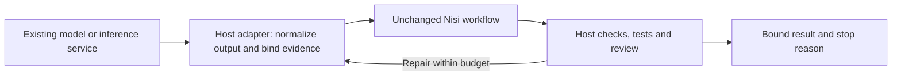

# Benchmarks for deciding whether to use Nisi

Run these benchmarks when evaluating Nisi's workflow controls, integration seam,
and execution overhead. They use the unchanged released v0.2.0 orchestrator.
The control, interface, and overhead commands do not call a model. A separate
opt-in local pilot does; neither establishes that Nisi improves model reasoning.

Use Node.js 22 or newer and clone `main`; the v0.2.0 release tag predates these
benchmark files:

```bash
git clone --branch main --depth 1 https://github.com/louiscalata/nisi.git
cd nisi
```

Then use new output directories:

```bash
node benchmarks/value/run.mjs ./control-results
node benchmarks/value/interop.mjs ./interface-results
node benchmarks/value/overhead.mjs ./overhead-results
node --test tests/value-benchmark.test.mjs tests/value-interop.test.mjs
```

The three benchmark commands write a source manifest, raw JSON results and a Markdown report.
Existing output directories are refused. The benchmark sources are source-checkout
tools, excluded from the packaged runtime's file list. The canonical development
roadmap is `roadmap.md` at the repository root.

| Question | What runs | What the result can establish |
|---|---|---|
| Are the checks and repair rules useful? | 25 authored control scenarios across a checked one-shot, a competent checked loop, and Nisi | Which specified control paths accept, repair or refuse; no production accuracy estimate |
| Can an existing inference interface be wrapped? | Synchronous callback, Promise text, host-aggregated async text, and the shipped chat adapter with fake HTTP transport | Four synthetic adaptation examples with the workflow unchanged; live provider compatibility remains unverified |
| How much does orchestration cost? | Trace-matched first-pass and one-repair paths, three file payload sizes, 1,200 measured pairs | Warm inert-callback runtime overhead on the measured host; no model speed or dollar-cost claim |
| Can the released local adapter carry one existing model? | A 12-task exploratory run against one local Gemma endpoint, using direct one-shot, checked-loop, and Nisi arms | This one integration worked; both checked arms tied at 12/12 output-contract matches after six structural repairs each |
| Does it improve real-world outcomes over another workflow? | A proposed confirmatory paired study | Not established; see the study plan |

The handwritten scheduler shares Nisi task/candidate validation and hashing. It
provides a competent scheduling comparison, not a fully independent competing
library. The one-shot arm differs in repair budget, so better recovery is not
attributed uniquely to Nisi. A tie is useful: it shows which controls a host can
reuse rather than maintaining another implementation. Development time saved
requires a separate integration study.

The [local pilot result and raw rows](results/README.md) show the difference
between a direct draft and a checked repair path under one configuration. The
one-shot arm had no repair budget, while the handwritten loop and Nisi each had
one repair and identical author request bytes at the corresponding stages. The
pilot was iterated on the same synthetic tasks, and cache behavior was not
measured. Treat it as a feasibility check, not a general accuracy or speed
estimate. All six one-shot outputs that missed the strict contract contained
the expected value but omitted the required `{"answer": ...}` wrapper.




The charts are calculated from the retained candidates and frozen answer key.
To regenerate them from the repository root with Python, `uv`, and Matplotlib,
run `uv run --with matplotlib --no-project python benchmarks/value/charts/render.py`.

## Adapt an existing inference system



The protocol can differ behind the callback. The host must still produce Nisi's
file-snapshot candidate and evidence schemas. The bundled local-chat adapter is
limited to a compatible loopback HTTP chat-completions endpoint with non-streaming
structured output. Async-stream aggregation in this demonstration is custom host
code. Hosted vendors, tool-calling, multimodal inference and embeddings are not
validated by these fixtures. The Apple advisory helper has a separate contract.

## Trust boundary

The dishonest-PASS specimen intentionally accepts a wrong answer when all host
callbacks lie consistently. Its external oracle flags **incorrect acceptance**.
Do not convert expected behavior across the specimens into a “100% accurate” or
“100% safe” claim. Nisi validates the evidence contract, not a callback's honesty.
Report-store acknowledgement tests likewise do not establish disk durability.

See [the controlled protocol](PROTOCOL.md) for exact methodology and amendments,
[the live study plan](LIVE-STUDY.md) for the next evidence needed,
[the exploratory local result](results/README.md), and the generated reports
for observed control outcomes and raw timing data.
