# Nisi

**An AI coding workflow inspired by a kitchen brigade.**

Nisi is an early JavaScript library for developers building AI-assisted coding tools. Its Workflow Engine calls application-supplied adapters for drafting, checks, tests, review, and a limited repair cycle, then validates their result records and returns a report explaining the outcome.

The design grows out of **initiate online code mode**, the assistant skill I use to organize coding work. Nisi puts its portable workflow rules into code: defined responsibilities, fixed acceptance criteria, separate author and reviewer roles, and evidence tied to the work being evaluated.

**Status: working prototype.** The engine, local model adapters, and examples are implemented. The verification record identifies the tested source and environment.

**A note from Louis:** I've been experimenting with AI agents and went down a bit of a rabbit hole. Nisi is a smaller piece of a bigger, messier workflow I'm cleaning up. It's a work in progress. Yes, I'm using Codex and Claude. Chill out, coding veterans. — Louis

## Why Nisi Exists

An AI assistant can produce a convincing answer without satisfying the original request. A useful coding workflow needs to keep the requirements in view, run the relevant checks, and show why a result was accepted or why work stopped.

Nisi gives application developers a reusable structure for that process. The application supplies its tools and model adapters; the engine carries the task through the configured stages and validates their result records. Developers can inspect a candidate, its checks, and its review together.

## Think of a Kitchen Brigade

An order starts with what the guest asked for, including allergies and other constraints. The Executive Chef sets the standards, the Sous Chef coordinates the work, and the Chefs de Partie prepare their parts. At the pass, the Expo checks the finished plate against the order. A plate that needs work goes back with a specific correction.

In Nisi, **the task is the order, permitted context is the ingredients, and the candidate is the dish**. A candidate is a proposed set of file contents. The engine coordinates the stages; the developer owns the requirements and the decision to apply or ship the result.

The analogy explains responsibilities. A station can be ordinary code, a test process, or a model adapter. Each role does not need its own AI agent.

## The Brigade in Developer Terms

| Kitchen role | Developer term | Responsibility |
|---|---|---|
| Executive Chef | Project owner | Defines requirements, scope, and release decisions |
| Order ticket | Task specification | Records permitted changes and fixed acceptance criteria |
| Receiving | Context authorization | Checks what information the host permits the task to use |
| Sous Chef | Workflow Engine | Sequences work, validates results, and limits repairs |
| Chef de Partie | Author adapter | Drafts a candidate and handles permitted corrections |
| Station inspection | Static checks and test runner | Evaluate the candidate and return findings and assertion results |
| Expo at the pass | Reviewer adapter | Examines the candidate and its check and test results |
| Send-back limit | Repair budget | Caps corrections and stops repeated candidates |
| Service record | Run report | Records the outcome and supporting stage results |

These roles are implemented as workflow contracts and application-supplied adapters. Nisi also includes local model adapters and supporting file-access, JSON, and Apple components. The developer terms are the names to use when discussing the API.

## The Path of One Plate

An edit task follows this sequence. Failed checks return to repair or stop the run before review.

```mermaid
flowchart TD
    order["Take the order · Task specification"]
    ingredients["Authorize context · Host policy"]
    cook["Prepare the plate · Author adapter"]
    checks["Check the work · Static checks and tests"]
    pass["Inspect at the pass · Reviewer adapters"]
    accept["Complete the workflow · Return the run report"]
    repair["Send the plate back · Bounded repair"]
    stop["Stop incomplete · Record the reason"]
    order --> ingredients
    ingredients --> cook
    ingredients -->|Authorization unavailable or refused| stop
    cook --> checks
    cook -->|No valid candidate| stop
    checks -->|Checks and tests pass| pass
    checks -->|Failed check and repair budget remains| repair
    checks -->|Missing evidence or no repair available| stop
    pass -->|All required reviews pass| accept
    pass -->|Failed review and repair budget remains| repair
    pass -->|Missing evidence or no repair available| stop
    repair --> cook
```



1. **Define the task.** Fix its scope, acceptance criteria, reviewer count, deadline, and repair budget.
2. **Authorize context.** The host checks the information and destination it permits this task to use.
3. **Draft the candidate.** The author proposes file contents within the task's allowed snapshot names.
4. **Check, test, and review.** Each stage receives the current candidate. Review follows passing checks and tests.
5. **Repair or finish.** A correction starts fresh checks and review. Repeated candidates stop the loop. The report records completion, failure, or the reason work could not finish.

Cancellation and deadlines can stop progress throughout the run. In review mode, the host supplies an existing candidate and the engine skips drafting and repair. Applying file changes remains a separate host action.

## What Works Today

The development checkout includes a sequential Workflow Engine, task and candidate contracts, local model author and reviewer adapters, and runnable examples. It returns an immutable report for each run and accepts an optional storage adapter.

The following components support related parts of an AI tool. Their boundaries remain distinct: a workflow's candidate allowlist constrains proposed file snapshots, while actual file reads and model destinations require their own authorization.

### File Access Policy

`createFileAccessPolicy` checks requested files against a declared scope, permitted kind labels, size limits, expiry, revocation, and UTF-8 requirements. Admission returns bytes and digests or a named refusal. For example, a resolved path outside the declared directory is refused with `CONTENT_OUT_OF_SCOPE`.

This component retains its Apple on-device destination contract. The declaration comes from the host application; it is not a captured approval click. Kind labels are supplied by the caller rather than detected from file contents. The host must route relevant reads through the policy.

### JSON Canonicalizer

`canonicalizeJsonV1` gives supported JSON a consistent byte representation and SHA-256 digest. Supported inputs that differ only in key order or insignificant whitespace can therefore be compared consistently.

Nisi uses a restricted profile with integer-only numbers and explicit limits. It is not RFC 8785/JCS. A digest identifies content; it does not establish that the content is correct or authorized.

### Apple Foundation Models Adapter

`createAppleFoundationModelsAdapter` connects admitted content to Nisi's native Apple helper for a bounded advisory reading. It checks the configured helper hash, limits execution time and output, and validates the returned report and matching digests.

The adapter requires a compatible Apple environment and a locally built helper. Its advisory reading is separate from the author, test, and reviewer stages of the coding workflow. Helper-reported behavior is not independent observation of the machine's network or storage activity.

### Static Analysis Check

The included check parses a marked region of the JSON codec and examines a defined set of direct call patterns. Its fixtures include forbidden examples and allowed look-alikes.

This is a check for that component. Applications supply the static checks appropriate to their own workflow candidates; Nisi does not provide a universal code analyzer.

## Why This Is Useful

Nisi makes the process around a candidate easier to inspect. A developer can see which stages returned results, what failed, whether repairs occurred, and why the run ended.

Fixed task criteria help keep corrections focused on the original request. Configured reviewer roles make responsibilities explicit. Repair limits prevent indefinite retries, and result records help distinguish a failed check from work that never ran.

The practical value is a consistent workflow that can be connected to an application's existing tools. Quality still depends on the task, the adapters, and the checks the developer chooses.

## From Skill to Workflow Engine

**initiate online code mode** is an installed assistant skill: operating instructions for organizing coding work. Its activation phrase works in an assistant configured with that skill.

Nisi is the JavaScript library that implements those portable principles. It can be used directly without installing the assistant skill. The application chooses models, authorizes context, supplies checking tools, and applies candidate changes through its own integrations.

Installing the Nisi package does not register the skill's activation phrase in every assistant. Machine setup, automatic model selection, and the larger workflow's host-specific worker routing are outside this library.

## LLM Orchestration

Nisi's experimental local chat adapters send author and reviewer requests to a configured loopback HTTP endpoint. Usable structured output depends on the selected server and models.

- **The author** produces a candidate and, when permitted, repairs it using the previous findings.
- **Checks and tests** return evidence about that candidate against the fixed task criteria.
- **The reviewer** receives the candidate and fresh check and test results, then returns findings and a summary.
- **The engine** validates those records and derives the workflow outcome. The model does not replace the task's rules or issue a final completion verdict.

The engine rejects duplicate reviewer IDs and an author/reviewer ID match. The host is responsible for making those adapters trustworthy and operationally separate.

A current local run used **Gemma 3 to draft a retry configuration**, passed **four fixed assertions**, and used **Gemma 4 to review the same candidate**. The workflow completed with the current JSON-schema request format. Other configurations stopped on empty final output or a review timeout. An earlier Qwen/GPT-OSS run also completed before that request-format change. These runs demonstrate a narrow integration and its refusal behavior; they do not establish general coding quality or measured token savings.

Validated responses retain receipts with request and response digests, elapsed time, and model identities and token counts reported by the endpoint when available. Failed calls retain a receipt and refusal code. A loopback destination does not establish where the server performs inference or whether it forwards data; the host must trust the server.

## Try the Development Prototype

Use Node.js 22 or newer in a clone of this repository:

```bash
npm ci
npm run check
npm run example:workflow
```

The deterministic workflow example runs actual Node syntax checks and assertions, repairs an intentionally incorrect result once, obtains a separate reviewer callback's result, and writes, syncs, and reads back a report. It makes no model calls.

For the model example, start a compatible local chat server and replace the model-name placeholders with two configured models:

```bash
node examples/local-model-workflow.mjs http://127.0.0.1:1234/v1/chat/completions AUTHOR_MODEL REVIEWER_MODEL
```

This example generates and checks JSON configuration data. It does not execute model-generated programs. The smaller file-admission example is available through `node examples/allow-a-file.mjs`.

See `docs/workflow-api.md` for the contracts and `docs/local-models.md` for adapter configuration.

## What Has Been Checked

The retained September 11, 2026 validation includes:

- **Automated checks:** 165 passing tests on each of Node.js 22 and 24 on macOS, plus eight forbidden and eight allowed static-analysis fixtures.
- **A deterministic workflow:** actual syntax checks and assertions, one repair, separate review, and a report verified after a disk write.
- **Local model runs:** a completed Gemma 3/Gemma 4 configuration task with the current JSON-schema format, plus retained empty-output and timeout outcomes. An earlier Qwen/GPT-OSS run completed before the format change.
- **Native Apple checks:** two passing executions of the advisory helper with different output caps on the tested Mac.

These are results for the recorded source and environment. Native Windows behavior, broader coding quality, and improvements in accuracy, token use, cost, or speed have not been established by these checks. Detailed counts, source hashes, and retained outcomes are recorded in `docs/verification.md`.

## Current Limits

Nisi trusts the host application and its adapters. It validates the structure, consistency, and identity of their reports; it cannot independently prove that a callback ran its tests or reviewed honestly. `COMPLETED` means the configured required stages supplied valid passing evidence.

The library is not an operating-system sandbox. Candidate paths are logical snapshot names, and file policies depend on the host routing reads through them. Revocation blocks later admissions but cannot recall returned bytes. The host must also manage changes to filesystem paths and helper executables during use.

Cancellation signals active adapters and prevents further workflow progress. Adapters must stop and clean up their own work; synchronous JavaScript cannot be forcibly interrupted. An optional report store is supplied by the application, and the engine trusts its acknowledgement rather than independently proving durable storage.

Candidate changes, commits, publication, and release decisions remain with the host and developer. The prototype provides a bounded process with inspectable results, not a guarantee that every accepted candidate is correct.

## Feedback and Ownership

Nisi is maintained by Louis Calata and licensed under Apache-2.0. Questions, unclear explanations, and reproducible issues are welcome through [GitHub Issues](https://github.com/louiscalata/nisi/issues).

See `CONTRIBUTING.md` for the contribution policy and `SECURITY.md` for the project's security scope. Pull requests are not currently being accepted.
