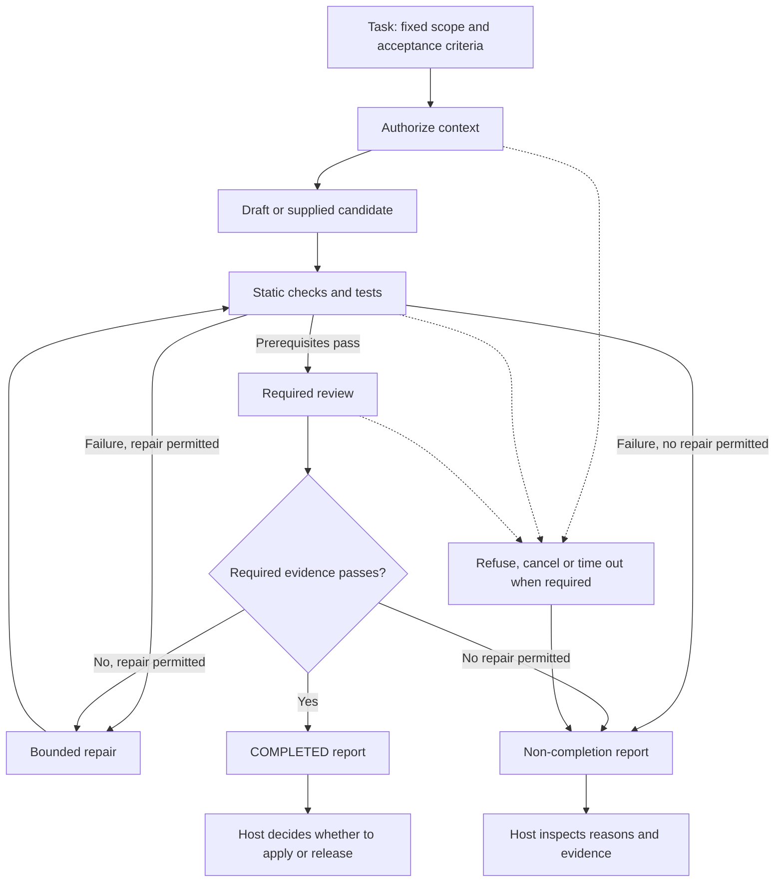
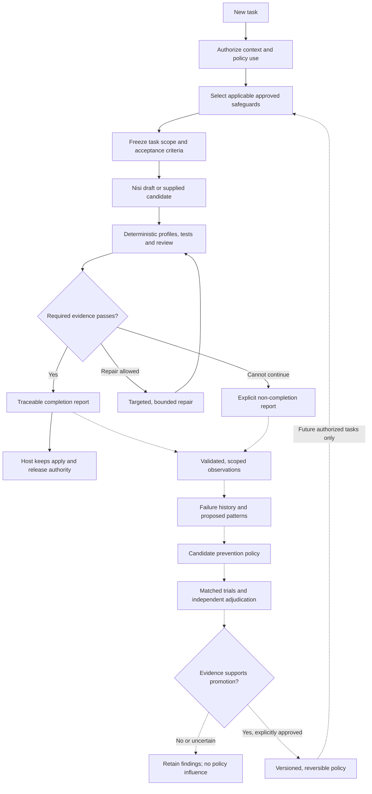

# Nisi v0.1 → v0.2

## Before and after the Veritas merger

**PRIVATE · PRODUCT & ENGINEERING COMPARISON**  
**Prepared:** September 12, 2026  
**Before:** Nisi `0.1.0`, baseline commit `02a0b39146596da6abaf279316ff7086cd70ec52`  
**After:** intended merged Nisi v0.2; current development identifier `0.2.0-private.0`  
**Current state:** selected Veritas source frozen with a dependency inventory;
private snapshot, disk-capture and execution-record consistency slices tested;
an owned async Swift adapter now checks one selected artifact inside Nisi and
retains real process receipts under an explicit operator-exclusive local scope.
Multi-file execution, two-layer outcome records, full native/workflow and
cross-product acceptance remain pending. Current evidence is in the
[canonical roadmap](../roadmap.md), not inferred from this historical baseline.

**Repository destination confirmed:** after the merger, Nisi is the sole active
product/repository. Veritas is retired as a separate product, not maintained as
a second development line. Reuse the existing Nisi repository and preserve
Veritas source, receipt identities and disclosure/evidence history. Cutover is
conditional on merger acceptance; no deletion or public disclosure is authorized
by this naming decision.

**Baseline note:** the “before” snapshot remains the original `02a0b39` comparison.
Public Nisi later advanced to `df321f8`; that revision's deadline correction and
workflow test have been carried into the private development copy. Historical
169-test evidence below still describes its original snapshot, not the newer
public 170-test record or this turn's focused 35-test workflow/import run.

> [!IMPORTANT]
> **The “after” column is the destination, not a finished-product claim.**
> Veritas source has been brought into a private Nisi working copy, but copying
> code does not connect, test or release its capabilities. This document separates
> the working foundation, staged components, integration work and research.

---

## 1. The change in one sentence

**Before — Nisi v0.1:** Coordinate one AI-assisted coding task through a bounded,
evidence-checked workflow.

**After — the v0.2 target:** Keep that workflow, add Veritas verification and
failure intelligence, and use evaluated prevention policies to help future tasks
avoid recurring mistakes.

> **The intended benefit:** Nisi should not only show how a task was handled.
> It should help explain recurring problems and demonstrate whether a proposed
> safeguard actually reduces them.

This is a merger of capabilities, not a claim that Nisi v0.1 lacked verification
or that Veritas already delivers autonomous learning.

## 2. At a glance

| Area | Before · Nisi v0.1 foundation | After · intended merged v0.2 |
|---|---|---|
| **Primary job** | Coordinate a single edit or review run against fixed criteria. | Coordinate the run **and** connect it to scoped reliability history. |
| **Verification** | Validate check, test and review records tied to the exact task and candidate. The host performs the work. | Add Veritas deterministic profiles through explicit adapters; keep unavailable or contradictory evidence distinct from passing evidence. |
| **Repairs** | Bounded repairs; each changed candidate repeats checks, tests and review. Repeated candidates stop. | Retain those limits and add targeted failure explanations. Verify the whole required contract after a targeted repair. |
| **Failure history** | Produce an immutable report; optional storage is a host callback. No built-in cross-run learning loop. | Connect validated observations to a scoped incident ledger with provenance, retention, replay handling and revocation. |
| **Prevention** | Host-supplied requirements are fixed for the run. | Evaluate policy candidates from recurring observations; approved policies may inform a future task before its criteria are frozen. |
| **Model use** | Optional local-chat and Apple advisory adapters; the workflow core does not choose or launch models. | Reconcile those adapters with Veritas run ownership, consent, budgets and actual cancellation/drain. |
| **Scheduling** | Sequential workflow; no durable scheduler, distributed workers or checkpoint/resume API in the core. | Integrate bounded shared-work scheduling where needed. Existing scheduler source does not establish whole-machine capacity management. |
| **Mac experience** | Node.js library and examples; Apple integration is an optional adapter. | Add the retained Veritas native app as an optional Nisi host, subject to native and UI acceptance. |
| **Modular nodes** | No integrated neural/plugin graph in the workflow engine. | Preserve the plugin, traveler and overlapping-node vision as an experimental extension, not a replacement for evidence rules. |
| **Learning** | No automatic promotion of a repair into reusable knowledge. | Separate observation, proposed explanation, evaluation and approved influence. Optional learning stays OFF by default. |
| **Trust report** | `COMPLETED` means configured required stages supplied valid passing evidence for that candidate. | Add traceable verifier, incident and policy references without turning a completion result into universal certification. |
| **Distribution** | Existing public source foundation, with its original licensing. | Private next-version work only. No merged release, publication clearance or App Store readiness is implied. |

## 3. Before: one bounded workflow

**Existing v0.1 structure, simplified.** Review-only mode starts with a supplied
candidate rather than a draft. Host adapters perform checks, tests and reviews;
Nisi validates their returned records and controls the sequence.

In human words: **“Handle this task within its rules, and show the records that
explain the result.”** Failed prerequisites route to repair or stop rather than
proceeding to review with invalid evidence.

The engine does not independently prove that a callback ran a test honestly,
that different reviewer IDs represent independent judgment, or that a storage
acknowledgement guarantees durable retention. These boundaries remain relevant
after the merger.

## 4. After: a workflow with an evaluated prevention loop

**Target architecture — not yet an integrated execution path.** Solid arrows
describe the intended task path; dashed arrows describe a separate, controlled
cross-run evaluation path. No failure observation automatically changes policy.

In human words: **“Handle this task reliably, record what is supported by the
evidence, test a proposed safeguard, and use it later only if it earns approval.”**

The native app and modular plugins sit around this path as hosts and extensions.
They do not gain authority to bypass required checks. Failed optional guidance
may reduce capability; a missing required check must not be treated as success.

## 5. What the difference feels like

### Example: an API change repeatedly misses a required test

**In v0.1**

1. The host defines the required test in the task's acceptance criteria.
2. A check or test reports that the candidate fails those criteria.
3. Nisi permits a repair within budget and repeats the checks.
4. The report records the final outcome. There is no built-in step that turns
   this report into a prevention policy for another run.

**In the merged v0.2 target**

1. The same bounded workflow still handles the current task.
2. An authorized adapter records a validated failure observation, with the exact
   task, candidate, verifier and evidence references.
3. Similar observations can suggest a pattern. Replayed copies are not counted
   as independent failures, and similarity alone does not establish root cause.
4. A candidate safeguard might request a test plan before drafting an API change.
5. Matched trials compare outcomes with and without that safeguard, tracking
   regressions, unnecessary interventions, cost and latency as well as failures.
6. Only an approved policy can influence a later authorized task. That later
   task still passes through the full required verification path.

**The improvement to demonstrate:** fewer recurring failures on comparable tasks,
without hiding failures, weakening checks or increasing other errors. No measured
improvement is claimed by this example.

## 6. What exists now, and what still has to be built

| Evidence level | Current position | What it does not mean |
|---|---|---|
| **Existing foundation** | Nisi v0.1 workflow, contracts, adapters and examples retained at the exact baseline. | Every possible host integration or model is verified. |
| **Staged, not integrated** | **225 Veritas source/configuration files** are frozen under `integrations/veritas/`: the main implementation and root contract plus tooling/native source, contracts, tests, fixtures and scripts. | Passing integration tests or 225 working Nisi features. The source freeze does not establish runtime readiness. |
| **Partial connection tested** | Real one-artifact Swift adapter inside Nisi; issued build/preparation identity, execution receipts, bounded cancellation/cleanup and persistent local reservation. | A complete multi-file host, safe arbitrary-code execution, hostile-filesystem protection, live-model workflow or durable resume. |
| **Integration remaining** | Multi-file verification and two-layer outcome reader, report-to-incident mapping, evaluated prevention, scheduling/provider reconciliation and native-host connection. | These paths currently run together as one product. |
| **Experimental scope retained** | JEPA-inspired filters, versioned module capabilities, traveling task roles, resource adaptation and the overlapping-node visual model. | A trained adaptive network, safe autonomous research, lossless compaction or proven speed gains. |

The staged native package currently declares **macOS 27**. This is a source-level
target, not installation proof or verified macOS 26.5 compatibility. The portable
Nisi library remains separate from that optional host.

The staging includes a retained historical gate-event test fixture. It is not a
live incident store. Its presence must remain explicit in the import/provenance
review; “no historical data copied” would be inaccurate. Original private evidence
remains retained at its source.

### Visual direction retained for the target

The overlapping coin/cucumber-slice nodes, two-sided connections, dichroic task
paths and node-focused camera remain part of the intended Nisi experience.
Traveler labels can make task roles understandable. They are a visual and
interaction model—not proof of physical electrons, extra computational dimensions
or increased throughput. Any learning, compaction or scheduling benefit needs
separate engineering evidence.

## 7. What must stay true through the merger

- **No silent weakening of v0.1.** Preserve current imports, report meanings,
  task bindings, cancellation behavior and bounded repair rules.
- **No invented certainty.** `NOT_RUN`, unavailable, inconclusive or contradictory
  evidence must not become `PASS`. Model confidence is not calibrated accuracy.
- **No automatic self-approval.** A repair is not a memory; a pattern is not a
  cause; a candidate policy is not an approved safeguard.
- **No rewritten history.** Preserve Veritas receipt identities, digest domains,
  adverse results and source provenance even when the product is called Nisi.
- **No hidden authority expansion.** Neither a plugin nor a scheduler can grant
  itself permission to inspect more files, use a provider, apply code or publish.
- **No guaranteed perpetual improvement.** Promotion requires evidence; policies
  need review, expiration or revocation, and reversible application.

> [!WARNING]
> **Private development does not authorize disclosure.** Keep this comparison,
> imported code and detailed design private until counsel classifies disclosure
> history, a filing decision is made, and the exact artifact passes the legal and
> engineering gates. Do not post this document to GitHub or send it to an external
> reviewer under an unrelated earlier approval.
>
> **Why this matters:** Renaming Veritas does not reset its disclosure history.
> The private worktree shares Git metadata with the original repository;
> `private: true` prevents ordinary package publication, not a Git push. The
> original Nisi license is not clearance to publish newly added private material.

## 8. From staged source to a real v0.2

The canonical task list is the [private next-version roadmap](../roadmap.md).
These are acceptance boundaries, not time estimates or a completion percentage.

Following the September 12 comparison feedback, the roadmap now explicitly requires
a complete multi-file repository host example, execution-linked records, TypeScript
consumer checks and a matched outcome evaluation. These are planned work, not
features provided merely by copying Veritas. The first example must show an actual
failed test, changed candidate, fresh verification and correct refusal of stale
results. A separate authorized live-model run must demonstrate more than a scripted
fixture. The evaluation separates task success from incorrect completion claims,
repair overhead, elapsed time and measured model usage.

| Milestone | Evidence needed to move forward |
|---|---|
| **NX-03 · Import freeze — complete within scope** | 225 exact-byte matches, per-file digests, provenance and dependency/data review. Imported runtime and integration are not accepted by this result. |
| **NX-04 · First working connection — partial** | One selected artifact now traverses the real Swift gate inside Nisi on tested fixtures. Multi-file repair, actual repository host, complete outcome records and the approved live-model demonstration remain required. |
| **NX-05 · Failure history** | Tested observation mapping, project isolation, replay/conflict handling, retention, revocation and uncertain writes. |
| **NX-06 · Prevention** | Matched policy trials, independent adjudication, no-regression evidence and controlled reversible promotion. |
| **NX-07 · Execution and native host** | Reconciled ownership, provider consent, actual cancellation/drain and native/UI verification. |
| **NX-08 · Modular extensions** | Explicit experimental contracts, resource limits and tested activation boundaries. Research claims remain separate. |
| **NX-09 · Whole-product acceptance** | Existing checks plus cross-component tests, rollback/refusal tests and real-task comparison against the baseline. |
| **NX-10 · Release decision** | Exact-version platform/install checks, legal gates and specific publication authorization. |

The next integration demonstration is **NX-04**; the source freeze is now complete.
It proves a narrow connection, not the whole merger. Failure intelligence, the
native host and modular scope remain on the roadmap after that demonstration.

## 9. Evidence and maintenance

This document is a private design comparison, not a new benchmark or patentability
assessment. No uniqueness score, patent-readiness percentage, quality uplift or
speedup is asserted.

The retained September 12 v0.1 verification record reports **169 passing tests on
each of Node 22.23.2 and Node 24.18.0**, with its stated scope: full suite before
a conservative preflight syntax change, followed by the four affected tests on
both runtimes. It records live-model and native Apple integration as `NOT_RUN`
for that revision and native Windows as `NOT_RUN`. These are **retained baseline
results**, not tests of the merger or fresh results from preparing this document.

Source references in this private working copy:

- [Foundation architecture and trust boundaries](architecture.md)
- [Workflow contracts and API](workflow-api.md)
- [Retained baseline verification receipt](verification/2026-09-12/summary.json)
- [Private next-version roadmap and NX acceptance tasks](../roadmap.md)
- [NX-03 source-freeze checks and dependency review](verification/2026-09-12/veritas-import-review.md)
- [Staged deterministic evidence contract](../integrations/veritas/native/macos/contracts/engine-evidence-v1.ts)
- [Staged failure-observation schema](../integrations/veritas/tooling/schemas/fi0-incident.schema.json)
- [Staged shared-work scheduler](../integrations/veritas/tooling/neural/shared-work-slot-scheduler.mjs)
- [Staged native package and deployment target](../integrations/veritas/native/macos/CodenameVeritasFramework/Package.swift)

**Update rule:** Keep the v0.1 baseline fixed. Move a v0.2 capability from planned
or staged to integrated only when its roadmap acceptance evidence exists for an
exact source revision. Date each update; preserve earlier failures and limitations.

## 10. AFM on-device model lane (addition, September 14)

**Goal:** Nisi should be able to use Apple's on-device Foundation Model
(AFM 3 Core) as a regular local LLM — and, through the public developer
framework, as an assistant-grade lane (tool calling, structured output,
vision) comparable in surface to cloud assistant offerings, while staying
fully on-device.

Evidence lives in the work order
`work-orders/afm-reverse-engineering-v1/` (README + `evidence/*`).

| Level | Item | Verified |
|---|---|---|
| **Integrated (this Mac)** | `fm serve` OpenAI-compatible endpoint on 127.0.0.1:1977 — `/v1/models`, streaming + non-streaming chat completions, real token usage | Yes (probes in `evidence/endpoint-probes.txt`) |
| **Integrated (this Mac)** | opencode provider registration `afm/system` (AFM 3 Core — On-Device, context 8192) in `~/.config/opencode/opencode.jsonc` | Registered; needs opencode restart to activate |
| **Integrated (this Mac)** | Latency benchmark vs pipeline default | AFM 3 Core **0.73 s** vs gpt-oss-20b **7.26 s** (same completion) |
| **Integrated (this Mac)** | Swift bridge `src/afm-bridge.swift` — runtime capability report over the public `FoundationModels` framework | `toolCalling: true`, `vision: true`, `guidedGeneration: true`, `reasoning: false` (Core, not Core Advanced), `isAvailable: true` — `evidence/afm-capabilities.json` |
| **Staged** | Tool-calling round-trip via `LanguageModelSession(model:.default, tools:[any Tool])` (public API) | Compile-proved symbols; full loop not yet built |
| **Staged** | Launchd autostart for `fm serve` | Manual wrapper `scripts/afm-serve.sh` only |
| **Not claimed** | Weight extraction (SIP-protected assets, `Operation not permitted`), AFM 3 Core Advanced reasoning (not present on this model tier), `tools` arrays through `fm serve` (chat-only, rejected) | Recorded limits |

No installs, no network egress, no weight extraction; everything runs on-device
through Apple's public framework and CLI. The v0.2 acceptance rule applies:
the capability report and endpoint probes are exact-revision local evidence,
not a finished assistant product.

---

**Product direction:** Nisi becomes the home for the Veritas reliability work—
one bounded workflow foundation, with traceable failure intelligence and evaluated
prevention added around it.
